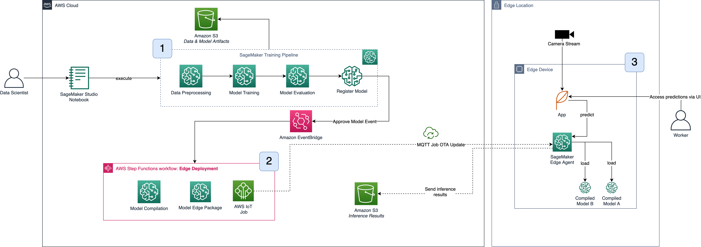
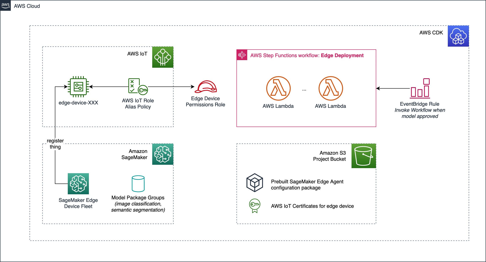
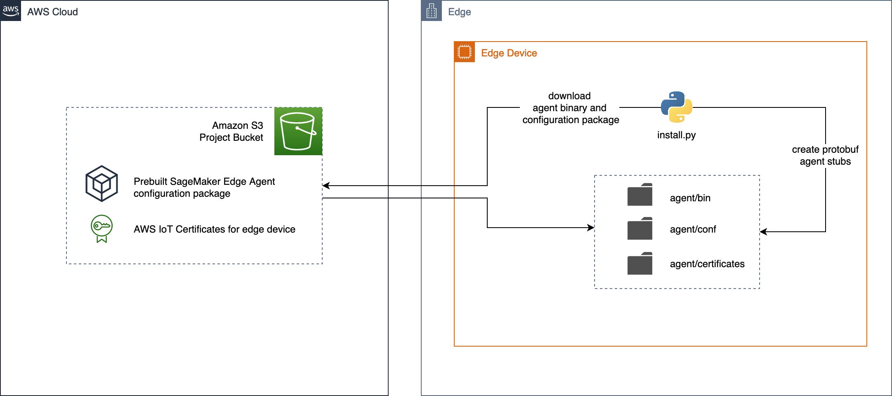
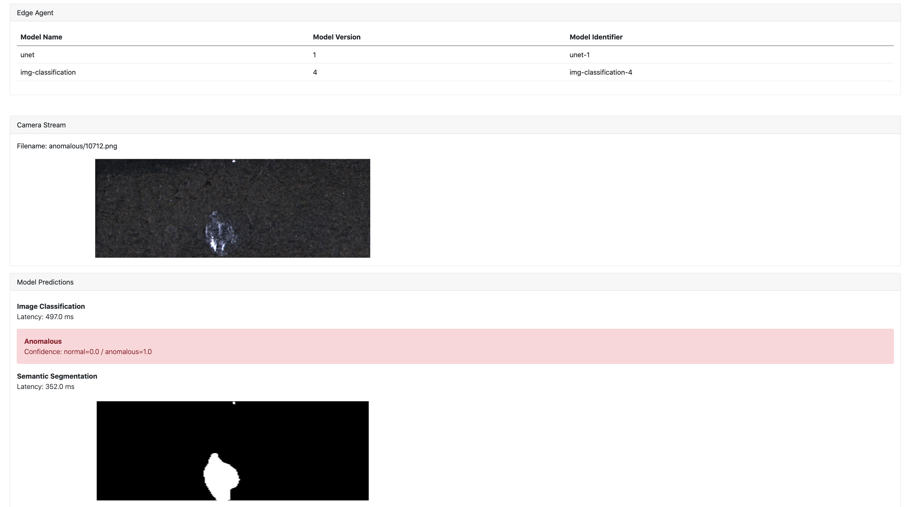

# Defect detection using computer vision at the edge with Amazon SageMaker

In this workshop, we will walk you through a step by step process to build and train computer vision models with Amazon SageMaker and package and deploy them to the edge with [SageMaker Edge Manager](https://aws.amazon.com/sagemaker/edge-manager/). The workshop focuses on a defect detection use case in an industrial setting with models like image classification, and semantic segmentation to detect defects across several object types. We will complete the MLOps lifecycle with continuous versioned over-the-air model updates and data capture to the cloud.

## Architecture

The architecture we will build during this workshop is illustrated below. Several key components can be highlighted:

1. **Model development and training on the cloud**: This repository contains code for two pipelines based on [SageMaker Pipelines](https://docs.aws.amazon.com/sagemaker/latest/dg/pipelines.html) for each of the two model types used (classification and segmentation). These pipelines will be built and executed in a SageMaker Studio notebook.
2. **Model deployment to the edge**: Once a model building pipeline executed successfully, models will be compiled with [SageMaker Neo](https://aws.amazon.com/sagemaker/neo/) and packaged with a [SageMaker Edge packaging job](https://docs.aws.amazon.com/sagemaker/latest/dg/edge-packaging-job.html). As such, they can be deployed onto the edge device via IoT Jobs. On the edge device an application is running which will receive the model deployment job payload via MQTT and download the relevant model package. The process of preparing the trained model for usage on the edge (i.e. compilation with Neo and packaging with Edge Manager) and deploying with AWS IoT is automated by using a step function workflow that is wired up to a approval event from SageMaker Model Registry.
3. **Edge inference**: The edge device is running the actual application for defect detection. In this workshop, we will use an EC2 instance to simulate an edge device - but any hardware device (RaspberryPi, Nvidia Jetson) can be used as long as SageMaker Neo compilations are supported. During setup, a configuration package is being downloaded to edge device to configure SageMaker Edge Agent. The Edge Agent on the device can then load models deployed via OTA updates and make them available for prediction via a low-latency gRPC API (see [SageMaker Edge Manager documentation](https://docs.aws.amazon.com/sagemaker/latest/dg/edge.html)).



## Dataset

This workshop is designed to be used with any dataset for defect detection that includes labels and masks. To be able to use both models (see section [Models](#models)), you will need a dataset of labelled images (*normal* and *anomalous*) as well as a set of respective *ground truth masks* which identify where the defect on a part is located. To train the models with the provided pipeline without any major code adjustments, you merely need to upload the dataset in the format together with correct path prefixes in an S3 bucket. Please refer to the [Getting Started](#getting-started) guide below on more details for model training with a dataset.

However, for simplicity of this walkthrough, we will showcase the end-to-end solution using the [KolektorSDD2](https://www.vicos.si/resources/kolektorsdd2/) dataset for defect detection. This dataset consists of over 3000 images of surface defects together with respective binary masks which identify the location of those defects in the image. This makes this dataset very much suitable for our use case.

Below you can find examples of those images and their masks as provided in the dataset. The image was taken from the [website](https://www.vicos.si/resources/kolektorsdd2/) of the creators of the KolektorSDD2 dataset (see also [Bozic et al., 2021] under [References](#references) ).


## Models

In this workshop, you will build two types of machine learning models:

* an image classification model using the [built-in SageMaker Image Classification algorithm](https://docs.aws.amazon.com/sagemaker/latest/dg/image-classification.html) based on the [MXNet framework](https://mxnet.apache.org/versions/1.8.0/)
* a semantic segmentation model built with [Tensorflow/Keras](https://github.com/tensorflow/tensorflow) using the [UNET deep learning architecture](https://arxiv.org/abs/1505.04597)

## Directory structure of this repository

This repository has the following directory structure:

```
├── cdk             <-- contains the CDK application for setting up the infrastructure for this project
└── src             <-- contains the actual source code for this project
    ├── cloud       <-- contains the code for model training in the cloud and initiation of OTA deployments to the edge
    └── edge        <-- contains the code that is running on the edge device
```

### Edge code directory structure

```
src/edge
├── app                         <-- python module for this application
│   ├── edgeagentclient.py      <-- abstractions for calling edge agent gRPC APIs
│   ├── logger.py               <-- utilities for logging output to AWS IoT Core
│   ├── ota.py                  <-- utilities for handling OTA IoT jobs
│   └── util.py                 <-- additional utilities
├── install.py                  <-- install script for downloading and configuring edge agent
├── models_config.json          <-- model configuration, also used for persisting model versions
├── run.py                      <-- runs the edge application
├── start_edge_agent.sh         <-- starts the SM edge agent
├── static                      <-- contains static images for Flask app, download test images here
└── templates                   <-- contains HTML Jinja templates for Flask app
```

### Cloud code directory structure

```
src/cloud
├── image_classification_pipeline.ipynb     <-- notebook for running the image classification pipeline
├── semantic_segmentation_pipeline.ipynb    <-- notebook for running the semantic segmentation pipeline
├── data_preparation.ipynb                  <-- notebook for data preprocessing of the KolektorSDD2 dataset
└── pipelines                               <-- model building code and pipeline definition
    ├── get_pipeline_definition.py          <-- CLI tool for CICD
    ├── run_pipeline.py                     <-- CLI tool for CICD
    ├── image_classification                <-- contains the pipeline code for image classification
    │   ├── evaluation.py                   <-- script to evaluate model performance on test dataset
    │   ├── pipeline.py                     <-- pipeline definition
    │   └── preprocessing.py                <-- script for preprocessing (augmentation, train/test/val split)
    └── semantic_segmentation               <-- contains the pipeline code for semantic segmentation
        ├── pipeline.py                     <-- pipeline definition
        ├── preprocessing.py                <-- script for preprocessing (augmentation, train/test/val split)
        ├── requirements.txt                <-- python dependencies needed for training
        └── train_tf.py                     <-- training script for training the unet model

```

## Walkthrough

Please follow the steps below to start building your own edge ML project. Please note that model training in the cloud and running inference on the edge are interdependent of each other. We recommend you start by setting up the edge device first and then train the models as a second step. This way, you can then directly deploy them to the edge after you have successfully trained the models.

### Setting up workshop resources by deploying the CDK application

1. Install the AWS CDK following the [official guide](https://docs.aws.amazon.com/cdk/latest/guide/getting_started.html) in the AWS documentation.
2. Install the dependencies by running `npm install` in the `cdk/` directory of this repository.
3. Deploy the CDK application by running `cdk deploy --parameters ProjectName=<YOUR PROJECT NAME>`. Choose a project name to assign to this project. You may choose any name, which is compliant with S3 bucket names, e.g. `sm-edge-project`. Make sure to take note of this name, as you will need it later on in the lab.

#### What is being created by the CDK application?

*(need to update)* This stack configures several resources needed for this workshop. It sets up an IoT device together with certificates and roles, an Edge Manager fleet, registers the device with the fleet and creates a package for edge agent configuration which is being saved in the S3 bucket for this project. The following image illustrates the resources being created with the CloudFormation stack.



### Configuring the edge device

1. Launch an EC2 instance with Ubuntu Server 20 with SSH access (e.g. via [Session Manager](https://docs.aws.amazon.com/systems-manager/latest/userguide/session-manager.html)) into a public subnet and make sure it gets assigned a public IP (you will need this later to access the web application). Ensure that it has access to the S3 buckets containing your configuration package (find the bucket name in the CloudFormation output). It will also need access to the bucket containing the SageMaker Edge Agent binary. For more information, refer to the [SageMaker Edge Manager documentation pages](https://docs.aws.amazon.com/sagemaker/latest/dg/edge-device-fleet-about.html). This EC2 instance will from now be considered our "edge device".
2. Clone this GitHub repository onto the edge device or simply copy the `src/edge` directory onto the edge device.
3. Install the dependencies by running `sudo apt update -y && sudo apt install -y build-essential procps` and `pip install -U numpy sysv_ipc boto3 grpcio-tools grpcio protobuf sagemaker paho-mqtt waitress`.
4. Run the installation script by running `python3 install.py --project-name <YOUR PROJECT NAME> --account-id <YOUR ACCOUNT ID> --region <YOU AWS REGION>`. This script will download the edge agent configuration package created during the CloudFormation deployment, download the edge agent binary and also generate the protobuf agent stubs. A newly created directory `./agent/` contains the files for the edge agent. The following image illustrated what happens in the installation script:



5. Create an environment variable to define the location of the agent directory. If you haven't changed your current directory, this would likely be `export SM_EDGE_AGENT_HOME=$PWD/agent`.
6. Start the edge agent by running `./start_edge_agent.sh`, which launches the edge agent on the unix socket `tmp/edge_agent`. You should now the able to interact with the edge agent from your application.
7. Before running the actual application, you need to define an environment variable which determines whether you want to run the app with the Flask development server or the with a production-ready uWSGI server (using [waitress](https://github.com/Pylons/waitress)). For now, lets use the production server by setting `export SM_APP_ENV=prod`. For debugging, you might want to later change this to `dev`.
8. Run the application with `python3 run.py` to initialize the application, verify cloud connectivity, connect to the edge agent. This application is a [Flask](https://flask.palletsprojects.com/en/2.0.x/) web application running port port 8080 which is integrated with SageMaker Edge Agent and AWS IoT for OTA updates. You will see that, if you have no models deployed yet and have not downloaded any test images, nothing will happen yet in the application. It will stay idle until it can access test images in the `/static` folder and run inference on those with a deployed model. In the next step, we will see how we can run automated model training with SageMaker Pipelines and deploy them onto the edge device for local inference.
9.  Go to the EC2 dashboard and browse the public IP address on port 8080, i.e. `http://<PUBLIC_IP>:8080`. You should now see the application in your browser window. *(Toubleshoot: ensure that you allow ingress on port 8080 in your instance's security group. Also, make sure your local firewalls on your device allow ingress through port 8080)*

### Automated model training in the cloud with SageMaker Pipelines

1. Create a SageMaker Studio domain and user by following [this](https://docs.aws.amazon.com/sagemaker/latest/dg/notebooks.html) guide in the documentation. Make sure that the IAM role used has access to the S3 bucket created during the CloudFormation deployment.
2. Clone this repository or copy the `src/cloud` directory onto the SageMaker Studio domain.
3. Prepare your dataset for training. In case you choose to use the KolektorSDD2 dataset like in this example, you can use the provided notebook under `src/cloud/data_preparation.ipynb` to download the dataset and partition it into the subdirectories needed for the training pipeline. With the provided pipeline code you can train two model types (image classification and semantic segmentation). You might want to set aside some images to be used for local inference. Download those onto the edge device and save them into the `static` folder so they can be used for inference by the edge application. Please note that we integrated a step in the preprocessing scripts to add a padding around the images in order to make them square, as the KolektorSDD2 dataset contains non-square images. If your provided images are already square, this step will be skipped. Just ensure that you use the same preprocessing for inference later (i.e. add padding if padding was added for training).
4. To use the pipelines without any code modifications you need to use structure your datasets as follows:
   * **Image Classification**: Your dataset needs to be split into `normal` and `anomalous` directories according to their respective label. Upload the data to your S3 bucket (e.g. under `s3://<BUCKET-NAME>/data/img-classification/`). Thus, your normal images will be located in `s3://<BUCKET-NAME>/data/img-classification/normal` and the anomalous ones in `s3://<BUCKET-NAME>/data/img-classification/anomalous`. Train / test / validation split will be done automatically in the preprocessing step of the pipeline.
   * **Semantic Segmentation**: Your dataset needs to be split into `images` and `masks` directories. Upload the data to your S3 bucket (e.g. under `s3://<BUCKET-NAME>/data/semantic-segmentation/`). Thus, your images will be located in `s3://<BUCKET-NAME>/data/semantic-segmentation/images` and the binary masks in `s3://<BUCKET-NAME>/data/semantic-segmentation/masks`. Train / test / validation split will be done automatically in the preprocessing step of the pipeline.
5. Execute the training pipeline: you will find a Jupyter Notebook for each of the model types in `src/cloud/`. Please adjust the project name you used during the CloudFormation deployment in the notebook. Also, you need to provide the S3 input data path as a parameter of the pipeline. Please make sure this aligns with the S3 path you used for uploading the dataset in step 3. You can monitor the pipeline execution in your SageMaker Studio domain. In case it finishes successfully, it should look similar to the one displayed below.


### Edge deployment and inference at edge

1. Once the pipeline finished successfully, your model is almost ready for use on the edge device. Please first verify that a new model version has been registered in the corresponding Model Package Group in the SageMaker Model Registry.
2. If you choose to accept the model version, please update the status from "ManualApprovalPending" to "Approved".
3. This action will emit an EventBridge event and automatically kick off the edge deployment workflow: this workflow starts the Neo Compilation job, the Edge Packaging job and finally creates an IoT job to notify the edge device of the new model update.
4. Verify that the Step Function workflow executed successfully and also check the IoT job to verify that it was executed successfully on the edge device.
5. You should now see your new model version in action on the edge application.


#### Persisting model configuration

You can set which models should be loaded initially by configuring the `model_config.json` file. The application will instruct the edge agent to load these models upon startup. You can update model versions by creating IoT jobs from the cloud. The OTA IoT client running alongside the application will listen to the job topics and download the model accordingly. Please also note that for each new model you deploy you might have to adjust your application code accordingly (e.g. if your input shape changes). The structure of the `model_config.json` file with a sample configuration is shown below.

In `"mappings"`, you can define which model should be used for each of the two inferences in the application this name needs to align with the model name you choose during OTA deployment. In `"models"`, information about the models loaded into the edge agent are persisted even after you shutdown the application. Please note that this is automatically filled out by the application and saved before you close out of the application. You do not need to manually configure this. In case you want to use a manually deployed model package with this application, you can instruct the application to load this model by manually adding a model definition into the JSON file under `"models"`.

```json
{
  "mappings": {
    "image-classification-app": "img-classification",
    "image-segmentation-app": "unet"
  },
  "models": [
    {
      "name": "img-classification",
      "version": "1",
      "identifier": "img-classification-1"
    }
  ]
}
```

#### Running inference on the edge device

To run inference on the device, you need to have fulfilled the following requirements:

* The edge agent on the edge device is properly configured and can successfully authenticate against AWS IoT
* You have downloaded test images onto the edge device in the folder `static/`
* You have deployed at least one of the two models (image classification or semantic segmentation) via OTA updates
* The edge agent is running and the models could be loaded successfully (for troubleshooting check command line output or edge agent logs in `agent/logs/agent.log`)

If everything is configured accordingly, you should see the edge application cycling through the provided images in the `static/` directory and run inference against both of the models. The result of the inference is then displayed in the web application. You can see a screenshot of the running web application below. The two models loaded into edge agent are displayed on the top, the incoming image from the camera stream is fed into the two models and the predictions are illustrated on the bottom of the page.



#### Continuously deploying new model versions to the edge

You can now continuously retrain your model on new data or with new parameter configurations and deploy them onto the edge device by running again through steps 1-5 in [Automated model training in the cloud with Sagemaker Pipelines](#automated-model-training-in-the-cloud-with-sagemaker-pipelines). Your application on the edge device will automatically download the new model packages (if the version provided is higher than the one used currently). It then unloads old model version from the edge agent and loads the newer version once available. It persists its model configuration in the JSON file described in section 5 of [Automated model training in the cloud with Sagemaker Pipelines](#automated-model-training-in-the-cloud-with-sagemaker-pipelines).

### Productionizing the solution

This workshop showcases a simple way of managing deployments of multiple CV models onto an edge device for defect detection use cases. For the sake of simplicity, we run certain steps in a manual fashion by e.g. preparing and deploying models from a Sagemaker Studio notebook. In a production setting, we recommend using dedicated pipelines both for the model building component as well as for the deployment component. Similar to the [MLOps reference architecture as outlined in the AWS blog](https://aws.amazon.com/blogs/apn/taming-machine-learning-on-aws-with-mlops-a-reference-architecture/), one would use Amazon EventBridge event rules to kick off the deployment process after a approval of a new version in the model registry has been detected. Likewise, the pipeline execution would be triggered by either a commit to a connected code repository or by other events that require retraining (e.g. detected model drift or new incoming data).

### Troubleshooting and FAQ

* *The application running on EC2 is not accessible through via public IP address.*
Make sure you opened up the port your application is running on in the security group attached to the instance. In case you cannot access the application through any other port than port 80, you could try to map the port 80 to 8080 by configuring a NAT redirect using the *iptables* command line tool as follows: `sudo iptables -t nat -A PREROUTING -p tcp --dport 80 -j REDIRECT --to-port 8080`
* *The edge application fails due to errors related with SageMaker Edge Manager*
You can try to restart the edge agent by killing the running process and starting edge agent again with the provided shell script. Make sure that `models_config.json` is configured such that desired models get loaded automatically upon application start. You can also check out the agent logs under `agent/logs` for troubleshooting.

## References

* aws-samples GitHub Repository "ML@Edge with SageMaker Edge Manager" 
https://github.com/aws-samples/amazon-sagemaker-edge-manager-workshop
* Ronneberger, O., Fischer, P., & Brox, T. (2015). U-Net: Convolutional Networks for Biomedical Image Segmentation. MICCAI. https://arxiv.org/abs/1505.04597
* Bozic, J., Tabernik, D. & Skocaj, D. (2021). Mixed supervision for surface-defect detection: from weakly to fully supervised learning. Computers in Industry. https://arxiv.org/abs/2104.06064

## Security

See [CONTRIBUTING](CONTRIBUTING.md) for more information.

## License

This library is licensed under the MIT-0 License. See the [LICENSE](LICENSE) file.
